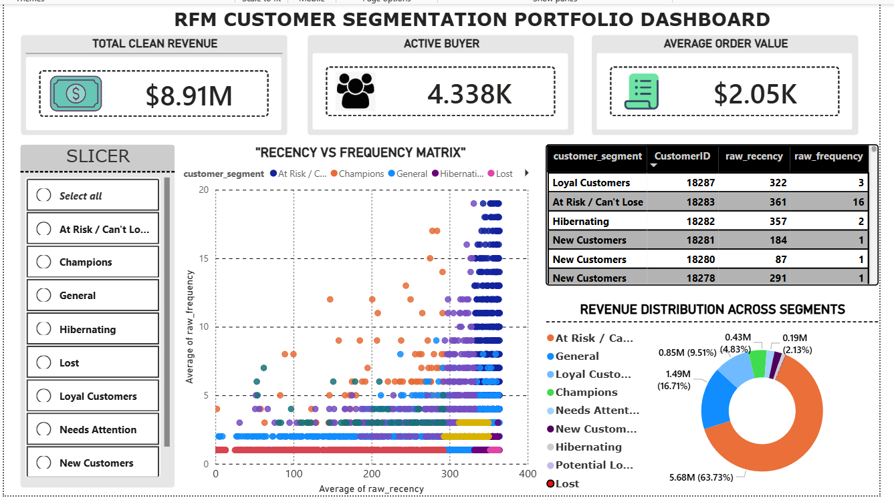

# E-Commerce Customer Segmentation & Behavioral RFM Dashboard

## 📊 Live Project Overview
An end-to-end data engineering and business intelligence project focused on calculating **Recency, Frequency, and Monetary (RFM)** metrics from raw transactional records. This dashboard groups over **4,300+ unique buyers** into actionable behavioral cohorts, enabling corporate marketing teams to identify high-value retention targets, re-engage lost accounts, and track revenue health.

### 🖼️ Dashboard Preview
 

---

## 🛠️ Tech Stack & Workflow
* **Database Management & ETL:** MySQL Workbench (Data Cleaning, Schema Updates, Date Parsing, CTEs)
* **Business Intelligence & Data Modeling:** Power BI Desktop
* **DAX Formulas:** Dynamic Key Performance Indicators (KPIs) and data formatting pipelines

---

## 📂 Project Structure
* 📁 `Data/` — Contains **`Sales_Data.csv`** (The raw transaction logs including Invoice numbers, Customer IDs, Dates, Prices, and Quantities).
* 📁 `Scripts/` — Contains **`RFM.sql`** (The entire MySQL processing pipeline used to clean data, isolate valid customer profiles, compute distinct tiles, and assign RFM alphanumeric strings).
* 📁 `Dashboard/` — Contains **`RFM.pbix`** (The final compiled Power BI file featuring interactive charts and layout grids).

---

## 💡 Key Business Insights Discovered
* **Revenue Concentration:** A minor, elite percentage of core **"Champions"** accounts drive a substantial share of total earnings. Ensuring VIP tier appreciation workflows is critical to guarding top-line revenue.
* **Lapse Alarm Columns (At Risk / Can't Lose):** The distribution scatter chart identifies a massive, tight cluster of high-frequency historical customers who have crossed the **300+ days** marker without a single follow-up transaction. This cohort represents an ideal population segment for immediate automated win-back discount campaigns.
* **One-Time Buyers Flatline:** A persistent baseline row highlights a massive group of single-purchase users extending across the entire calendar matrix. This visualizes an acquisition-versus-retention gap, highlighting the need to incentivize second-order placements within 30 days of onboarding.

---

## ⚙️ How to Explore the Dashboard
1. Download **`RFM.pbix`** from the `Dashboard/` folder.
2. Ensure you have the latest version of **Power BI Desktop** installed.
3. Open the file to interact with the integrated slicers, scatter distribution quadrants, and dynamic target rows.
